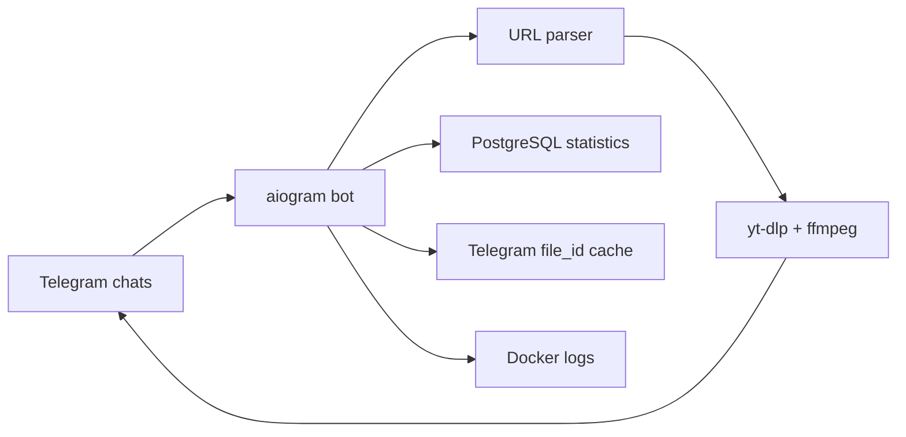

# Architecture

Kokos is a polling-based Telegram bot designed for simple server deployment.

## Components

- `app/bot.py` - Telegram handlers, commands, and message flow.
- `app/url_parser.py` - TikTok and YouTube Shorts URL detection.
- `app/downloader.py` - `yt-dlp` execution and temporary file cleanup.
- `app/db.py` - PostgreSQL schema and statistics queries.
- `docker-compose.yml` - bot, PostgreSQL, and Redis services.

## Data Flow

1. A user sends a message.
2. The bot records user and chat activity.
3. The URL parser extracts supported links.
4. The bot checks the Telegram `file_id` cache.
5. If cached, the bot replies immediately.
6. If not cached, the downloader fetches the video.
7. The bot uploads the video and stores the returned `file_id`.
8. The link event is saved for statistics.

## Scaling Notes

The current implementation limits parallel downloads with an in-process
semaphore. For larger deployments, Redis can be used for distributed queues,
rate limits, and worker separation.

